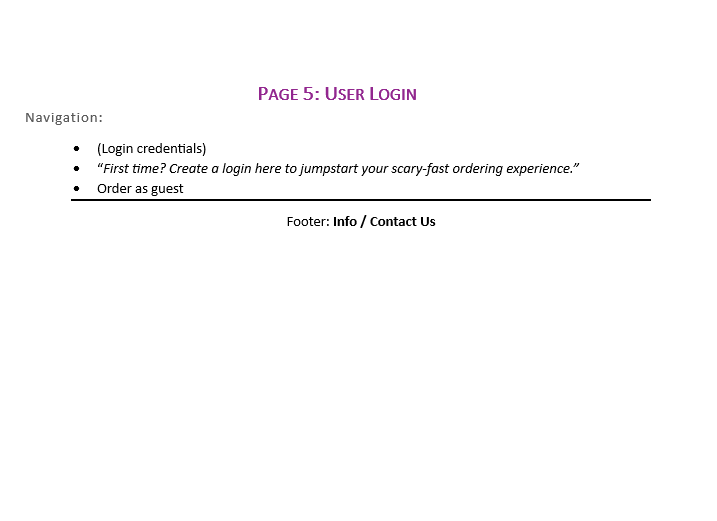
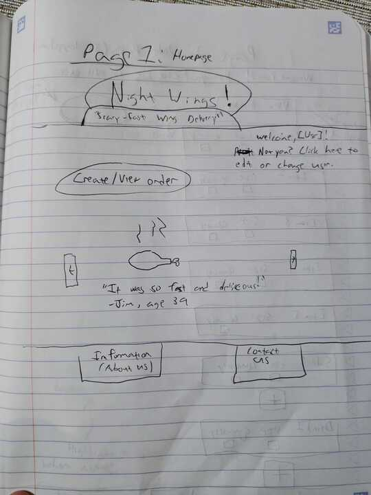
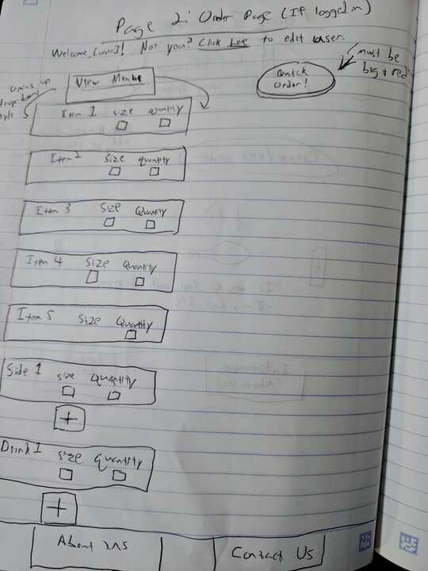
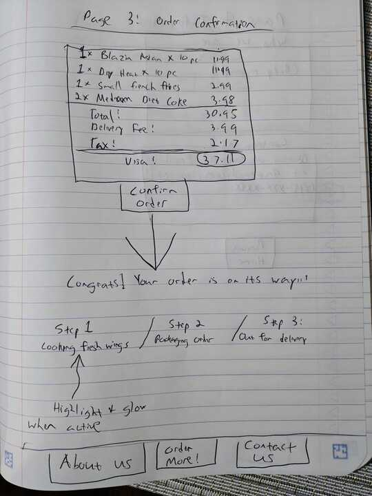
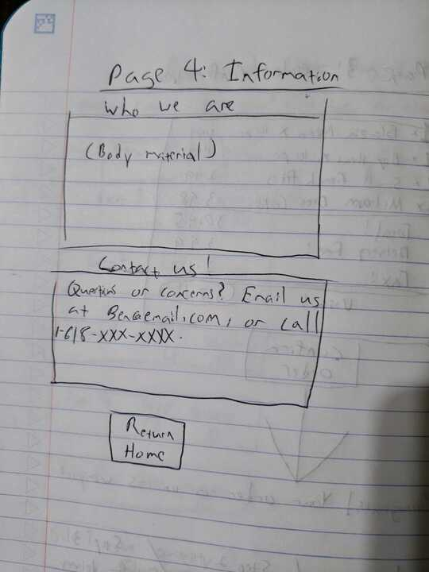
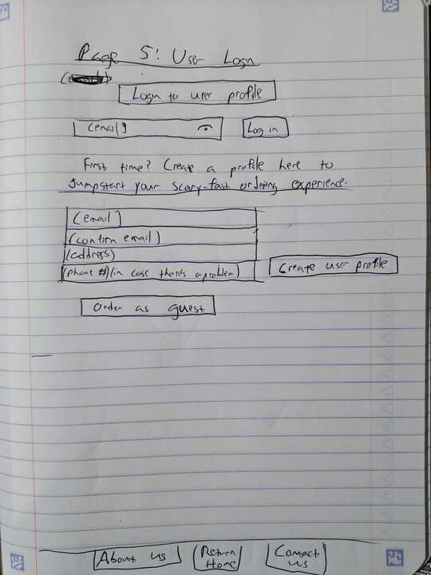

<h1>Capstone Project: "Night Wings!"</h1>

## **Definition Statement:** ##
I will be creating an application that allows users to be able to order a delivery of chicken wings (or any of their favorite foods) very quickly and conveniently, within 3 clicks of opening the application.

## **Target Audience:** ##
My market segment will those who wish to order a late-night meal within a local wing restaurant's delivery radius, while avoiding as much "hassle" as possible.

## **Link to Mural Story Map:** ##

## **Content Outline** ##

<!--  -->

<!--  -->

## **SWOT Analysis** ##

## **User Flow Diagram** ##

## <u> Wire Frames (Hand-crafted) </u> ##

<!--  -->

